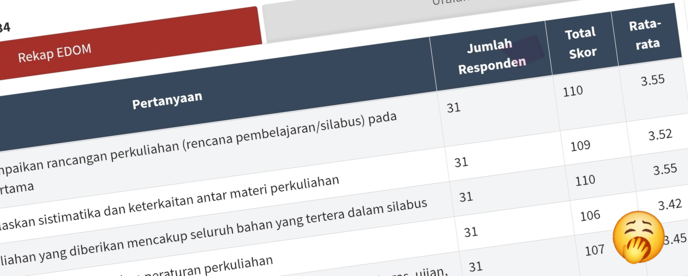

# JIKA EDOM INTERAKTIF ...

<i class="fab fa-github"></i> [GitHub](https://github.com/ipgub/EDOM)

<i class="fab fa-instagram"></i> [Instagram](https://www.instagram.com/ipg.tif/)

Bayangkan jika Evaluasi Dosen Oleh Mahasiswa (EDOM) bukan lagi sekadar mengisi form dengan skala 1-4 yang membosankan, lalu menulis komentar di kotak kecil yang serasa kurang tempat. Bayangkan jika EDOM bisa menjadi sebuah dialog yang hidup, interaktif, dan benar-benar memberikan _insight_ yang mendalam tentang apa yang terjadi di dalam kelas.

## Ketika Data Bercerita

Hari ini, kita hidup di era ketika data bukan lagi sekadar angka yang dingin dan kaku. Data bisa bercerita, bisa menunjukkan pola, bahkan bisa "berbicara" dalam bahasa yang mudah dipahami oleh siapa saja. Lalu mengapa EDOM masih _stuck_ di format tradisional yang terasa seperti survei tahun 90-an?

Dalam dunia yang serba digital sekarang ini, kita sudah terbiasa dengan _dashboard_ yang interaktif, visualisasi yang menarik, dan _storytelling_ berbasis data. Netflix tahu film apa yang kita suka. Spotify bisa bikin playlist yang pas dengan mood kita. Tapi evaluasi pendidikan? Masih pakai cara lama: _isi form, submit, tunggu hasil semester depan, repeat_.

## Suara Mahasiswa yang Terdengar

Mahasiswa sebenarnya punya banyak hal untuk dikatakan. Mereka punya perspektif unik tentang cara dosen mengajar, tentang materi yang mudah dipahami atau membingungkan, tentang momen-momen di kelas yang membuat mereka "aha!" atau malah "hah?". 

Tapi seringkali, suara mereka terkubur dalam format yang kaku. _"Bagaimana Anda menilai kualitas pengajaran dosen?"_ dengan pilihan 1-4. _Really?_ Pengalaman belajar seseorang bisa disederhanakan jadi satu angka?

Yang lebih menarik adalah ketika kita mulai mendengarkan apa yang sebenarnya mereka katakan. Ketika data EDOM diolah dengan cara yang lebih _humanis_, dengan analisis yang mendalam, dan disajikan dalam format yang bisa dipahami siapa saja, cerita yang muncul jauh lebih kaya dan bermakna.

## Cerita di Balik Angka Kalkulus

Ambil contoh kasus mata kuliah kalkulus yang akan kita bahas di sini. Di permukaan, angka-angka evaluasinya terlihat biasa-biasa saja. Rating 3.22, 3.39, 3.38 - tidak ada yang dramatis. Tapi ketika kita gali lebih dalam, ada cerita yang jauh lebih menarik.

Ada kisah tentang mahasiswa yang merasa dosennya tiba-tiba _"ngajar kecepetan"_ - keluhan yang naik dari 2% ke 11.6% dalam setahun. Ada drama tentang interaksi yang berkurang, tentang generasi mahasiswa yang mungkin butuh pendekatan berbeda, tentang dampak pandemi yang masih terasa hingga hari ini.

Ini bukan sekadar laporan evaluasi. Ini adalah _snapshot_ dari dinamika pembelajaran yang kompleks, dengan berbagai faktor yang saling berinteraksi.

## Ketika EDOM Menjadi Dialog

Jika EDOM bisa menjadi interaktif, mungkin kita bisa

- **Melihat tren _real-time_** - bukan menunggu akhir semester untuk tahu ada masalah
- **_Drill down_ ke detail** - dari angka global ke pengalaman spesifik per topik bahasan
- **Memberikan _context_** - mengapa rating turun? Apa yang sebenarnya terjadi?
- **_Actionable insights_** - bukan hanya "rating turun", tapi "rating turun karena _pace_ terlalu cepat, terutama di materi limit dan turunan"
- **_Feedback loop_** - dosen bisa _respond_, mahasiswa bisa _update_, _creating continuous improvement cycle_

## _Beyond Numbers: Understanding Humans_

Yang paling penting, EDOM interaktif bisa membantu kita memahami bahwa di balik setiap angka, ada manusia. Ada mahasiswa yang _struggle_ dengan materi, ada dosen yang berusaha memberikan yang terbaik, ada dinamika kelas yang unik di setiap semester.

Data bukan musuh. Data adalah teman yang bisa membantu kita memahami apa yang sebenarnya terjadi, memberikan _insight_ untuk perbaikan, dan pada akhirnya menciptakan pengalaman belajar yang lebih baik untuk semua.

## _Welcome to the Data Story_

_Mock up_ halaman web yang bisa Anda lihat di [sini](https://ipgub.github.io/EDOM/) adalah contoh kecil dari apa yang bisa terjadi ketika kita memperlakukan data EDOM bukan sekadar kewajiban administratif, tapi sebagai sumber _insight_ yang berharga. Kita akan melihat bagaimana 198 mahasiswa dari 5 semester yang berbeda bercerita tentang pengalaman mereka di kelas mata kuliah kalkulus.

Kita akan melihat tren yang mengejutkan, _pattern_ yang menarik, dan yang paling penting - rekomendasi yang _actionable_ untuk membuat pembelajaran menjadi lebih baik.

Data ini disajikan dalam format yang mudah dicerna, dengan visualisasi yang menarik, dan bahasa yang nggak bikin ngantuk. Karena memang begitu seharusnya data disajikan - _informatif tapi tetap engaging_.

Siap untuk melihat apa yang sebenarnya mahasiswa katakan tentang kelas kalkulus mereka? Let's dive in!

Link _mock up_ EDOM interaktif bisa diakses melalui [https://ipgub.github.io/EDOM/](https://ipgub.github.io/EDOM/).

Halaman tersebut dibuat berdasarkan data mentah yang bisa diakses melalui [https://ipgub.github.io/EDOM/rawdata](https://ipgub.github.io/EDOM/rawdata)

---

*Mari kita mulai perjalanan data storytelling ini. Siapa tahu, ini bisa jadi inspirasi untuk EDOM yang lebih interaktif di masa depan.*

